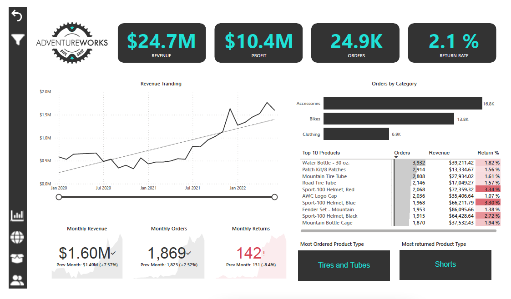
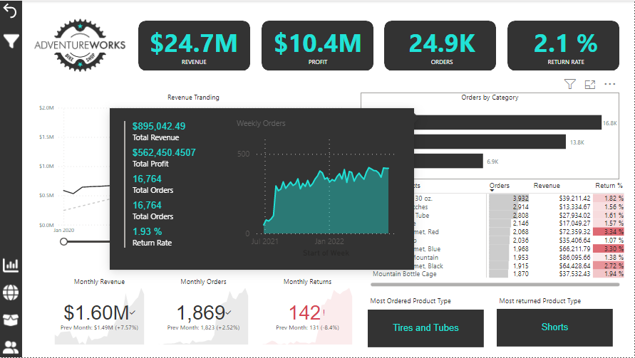
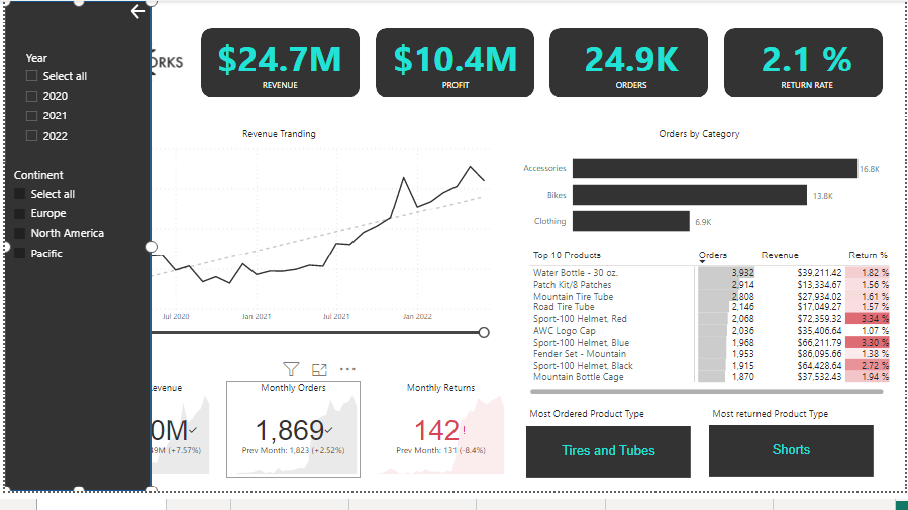
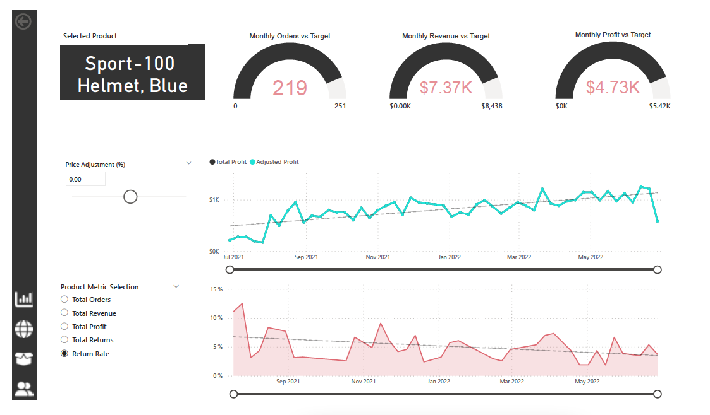
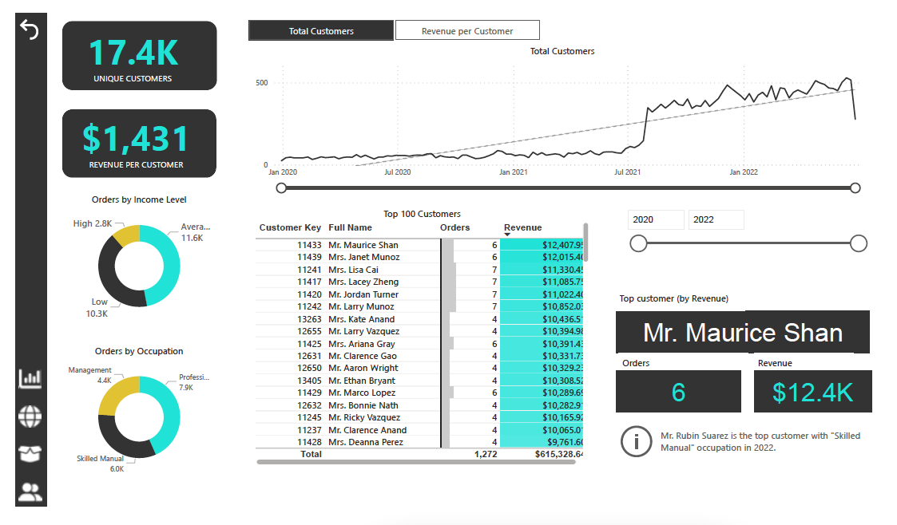
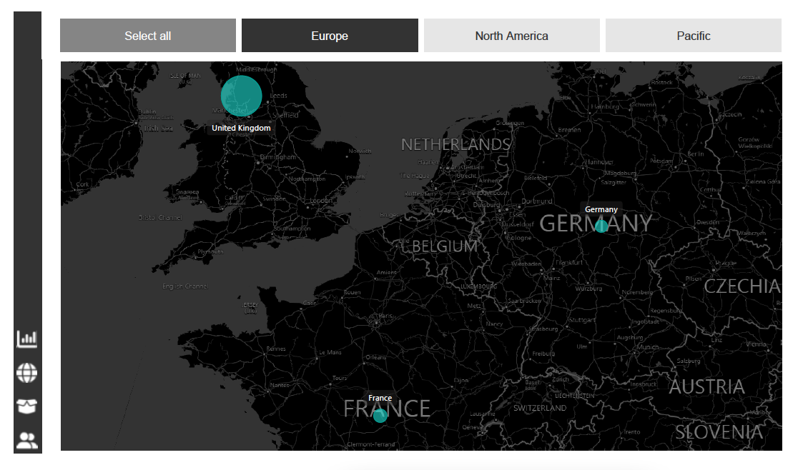
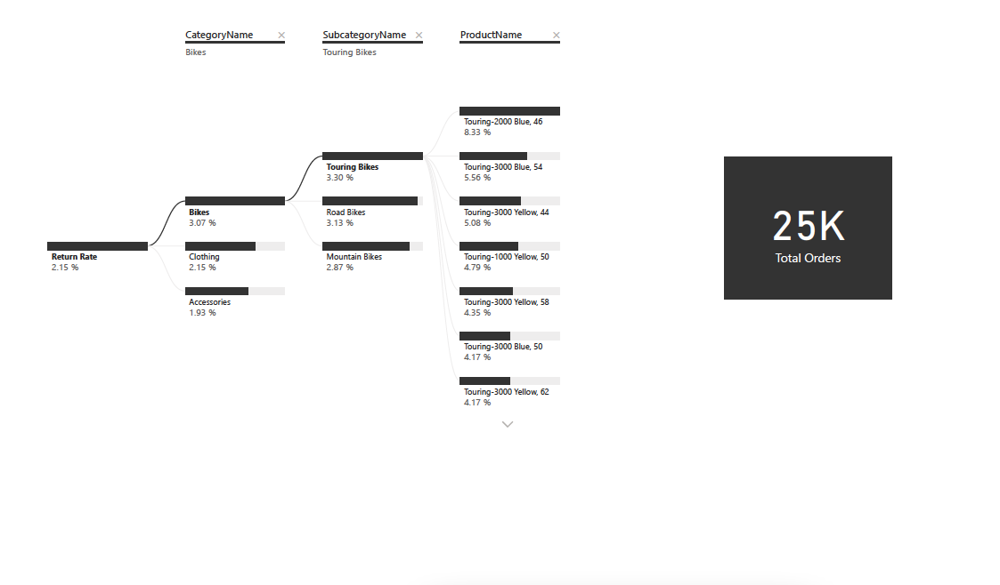

## Introduction and Objective 
A fictitious global manufacturing company, AdventureWorks produces cycling equipment and accessories.
In this work,we will help the management team track their KPIs, things like sales, revenue, profit and returns, compare performance across regions, analyze product-level trends, and identify high-value customers.

But all we have a folder of raw CSV files, which contain information about transaction and return records, products, customers, and sales territories. So we will use Power BI desktop to connect and transform that raw data, build a relational data model, create calculated columns and measures with DAX, and finally, design an interactive dashboard to help visualize and analyze that data.

## AdventureWorks Report Summary
### Executive summary view
This view presents present high level KPI's such as revenue, profit, orders, and return rate followed by weekly trending chart having drill down functionalities.

  
--
   
--

### Product level view
The drill down functionality so that customer can drill into any specific product's detail view. This view shows us how the product is performing against its monthly order, revenue, or profit target. It also contains parameters to check how does it change to the price adjustment impacts a metric like total profit etc.

### Customer level view
Customer-level view presents a drilldown aspect into performance at the individual customer level and break down different customer profiles and segments.

### Geospatial view
This view is provided to check geospatial tools and to drill down into each continents and see the corresponding orders and business behavior. 

### Decision tree view
In this view, the management team also an option to check the Return rate metric from category to product level and corresponding orders.

