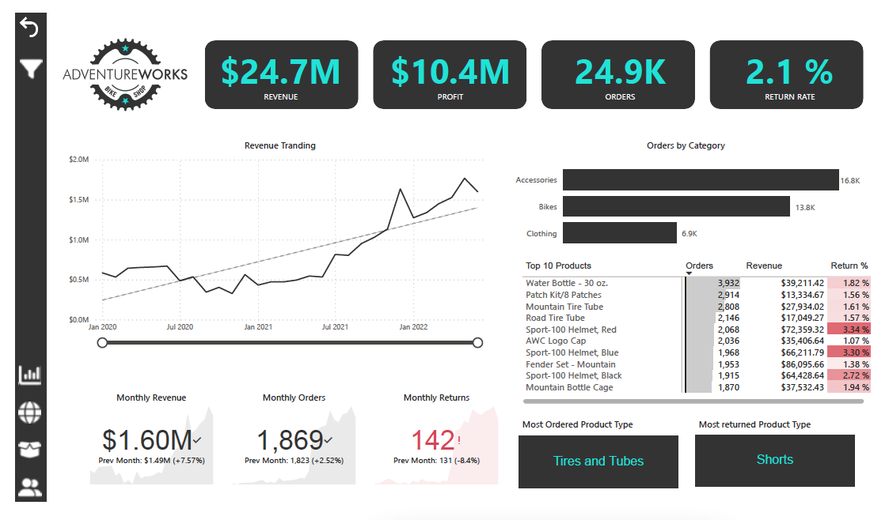
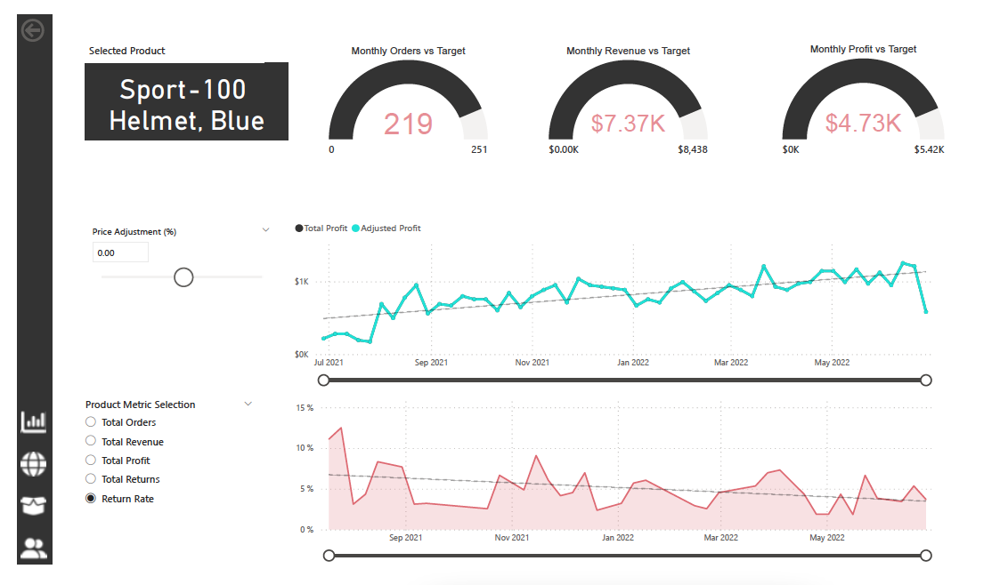
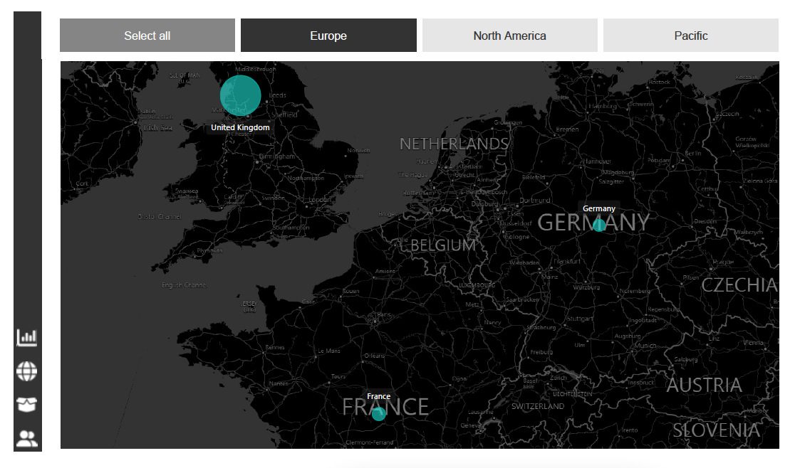
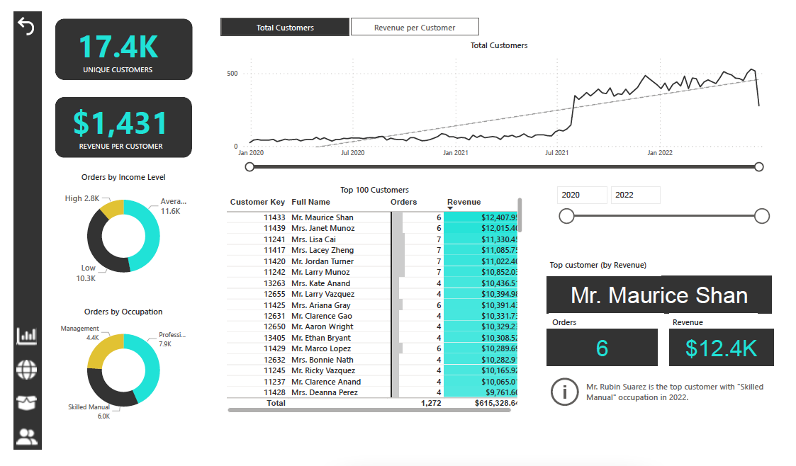
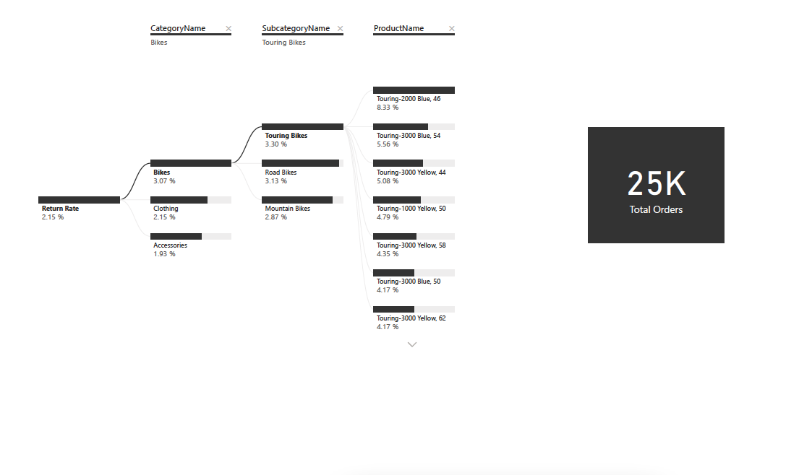

## Introduction and Goal:  
A fictitious global manufacturing company, AdventureWorks produces cycling equipment and accessories.
In this work, We have given a role is to help the management team track their KPIs, things like sales, revenue, profit and returns, compare performance across regions, analyze product-level trends, and identify high-value customers.

But all you've been given is a folder of raw CSV files, which contain information about transaction and return records, products, customers, and sales territories. So your objective here is to use Power BI desktop to connect and transform that raw data, build a relational data model, create calculated columns and measures with DAX, and finally, design an interactive dashboard to help visualize and analyze that data.

## AdventureWorks Report Summary
We have the following Pages in our Report.

### Executive summary view:
This view presents present high level KPI's such as revenue, profit, orders, and return rate followed by weekly trending chart having drill down functionalities.

### Product level view:
The drill down functionality so that customer can drill into any specific product's detail view. This view shows us how the product is performing against its monthly order, revenue, or profit target. It also contains parameters to check how does it change to the price adjustment impacts a metric like total profit etc.

### Geospatial view:
The user also have option to check geospatial tools and drill down into each continents and see the sales behavior. 

### Customer level view:
Customer-level view presents a drilldown aspect into performance at the individual customer level and break down different customer profiles and segments.

### Decision Tree view:
In this view, the user also an option to check the Return rate metric from category to product level and corresponding orders.

